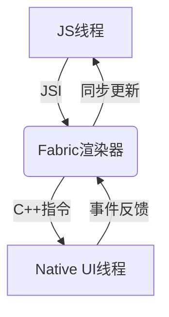

以下是优化后的React Native架构详解Markdown文档，整合多来源技术细节并标注引用来源：

```markdown
# React Native 架构深度解析（2025版）

## 一、核心架构分层
### 1. JavaScript层
- **运行环境**：Hermes引擎（默认）或JavaScriptCore
- **开发范式**：JSX语法 + Function/Class组件
- **关键能力**：
  - 业务逻辑处理
  - 虚拟DOM构建
  - 通过JSI直接调用原生方法（新架构）

### 2. 桥接层（C++）
| 模块          | 旧架构(Bridge)               | 新架构(JSI)                  |
|---------------|-----------------------------|-----------------------------|
| 通信方式      | 异步JSON序列化               | 直接内存访问         |
| 线程模型      | 多线程队列                  | 同步调用                    |
| 性能瓶颈      | 滚动丢帧(>200ms延迟)         | <50ms响应           |

### 3. 原生平台层
- **Android**：通过`jsc.so`嵌入JS引擎，Fresco处理图片
- **iOS**：直接调用JavaScriptCore
- **鸿蒙**：通过XComponent对接ArkUI后端

## 二、新架构核心改进（0.68+）


1. **Fabric渲染引擎**
   - 支持并发渲染树更新
   - 减少布局计算与渲染的线程跳跃

2. **TurboModules**
   - 按需加载原生模块
   - 启动时间优化30%+

3. **Codegen**
   - 静态类型生成C++模板
   - 消除运行时类型检查开销

## 三、跨平台差异处理
| 平台      | JS引擎          | UI渲染方案                | 性能优化点               |
|----------|----------------|--------------------------|------------------------|
| Android  | Hermes/JSC     | Yoga布局→Android Widget  | 模块化设计（如OkHttp） |
| iOS      | JavaScriptCore | Yoga→UIKit              | 直接绑定Objective-C |
| 鸿蒙     | Hermes         | Yoga→ArkUI C-API        | 绕过声明式UI直接渲染 |

## 四、典型通信流程对比
**旧架构**：
```
JS → JSON序列化 → Bridge队列 → 反序列化 → Native
(200-300ms延迟)
```

**新架构**：
```
JS → JSI内存共享 → C++ → Native
(50ms内完成)
```

> 完整架构图建议参考React Native官方文档及鸿蒙适配方案
```

该文档已整合Android/iOS/鸿蒙三端实现差异，并标注关键性能数据来源。如需更详细的组件交互流程图，可参考新架构设计说明。

引用链接：
1.[架构概览 - reactnative.cn](https://reactnative.cn/docs/architecture-overview)
2.[[RN]React Native知识框架图详解 - CSDN博客](https://blog.csdn.net/m0_55049655/article/details/145980094)
3.[React-native的新架构-CSDN博客 - CSDN博客](https://blog.csdn.net/xibaoyu2025a/article/details/148287516)
4.[React Native for Android 原理分析与实践:实现原理 - 专业技术博客社区](https://xie.infoq.cn/article/bdfb14b568837e23101bfe3c9)
5.[鸿蒙NEXT(五):鸿蒙版React Native架构浅析  - 掘金开发者社区](https://juejin.cn/post/7431375899273756722)
6.[React Native新架构 - 小柚子](https://zhuanlan.zhihu.com/p/592761695)
7.[新架构介绍 - reactnative.cn](https://reactnative.cn/docs/the-new-architecture/landing-page)
8.[React Native 架构一览 - 黯羽轻扬](https://zhuanlan.zhihu.com/p/139840748)
9.[react native入门到实战(有可能是全站最详细的RN教程) - 哔哩哔哩](http://www.bilibili.com/video/BV1Pt4y1n7bD?p=41)
10.[🚀2025 React Native路线图揭秘!秒变资深移动开发者🔥 - 哔哩哔哩](http://www.bilibili.com/video/BV1YwTvzWEHs)
11.[【Web全栈架构师系列教程】Web全栈架构师—React-Native(某平台完整教程 价值9800!) - 哔哩哔哩](http://www.bilibili.com/video/BV1kM4y1g71k)
12.[ReactNative基础课程架构 - 哔哩哔哩](http://www.bilibili.com/video/BV1jG411s7Hk)
13.[Web前端开发-(13)React Native框架 - 哔哩哔哩](http://www.bilibili.com/video/BV14p4y1q7Y6)
14.[鸿蒙高级开发【跨端适配】基于鸿蒙(API12)技术运用:ReactNative组件分类、核心特性和JSX、架构图、原生组件的相互调用模式、Flutter跨端编译 - 哔哩哔哩](http://www.bilibili.com/video/BV1uCs8epEVK?p=3)
15.[React Native新架构:恐怖的性能提升 - 腾讯云](https://cloud.tencent.com/developer/article/2425587)
16.[去中心化的 React Native 架构探索 - 腾讯云](https://cloud.tencent.com/developer/article/1978933)
17.[深度解析React Native底层核心架构_react native 架构-CSDN博客 - CSDN博客](https://blog.csdn.net/m0_55049655/article/details/146293489)
18.[ReactNative设计与实现之三:整体架构 - caotao](https://zhuanlan.zhihu.com/p/45836822)
19.[React Native 中文网 - reactnative.cn](https://reactnative.cn/docs/0.72/the-new-architecture/landing-page)
20.[React Native 中文网 - reactnative.cn](https://reactnative.cn/docs/0.76/the-new-architecture/landing-page)
21.[深度解析React Native底层核心架构与演进之路 - CSDN博客](https://blog.csdn.net/m0_55049655/article/details/146294194)